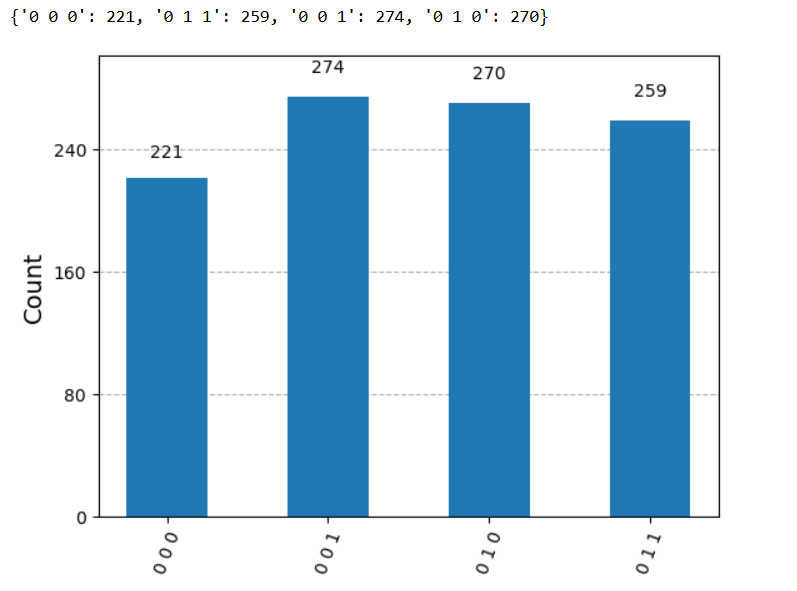
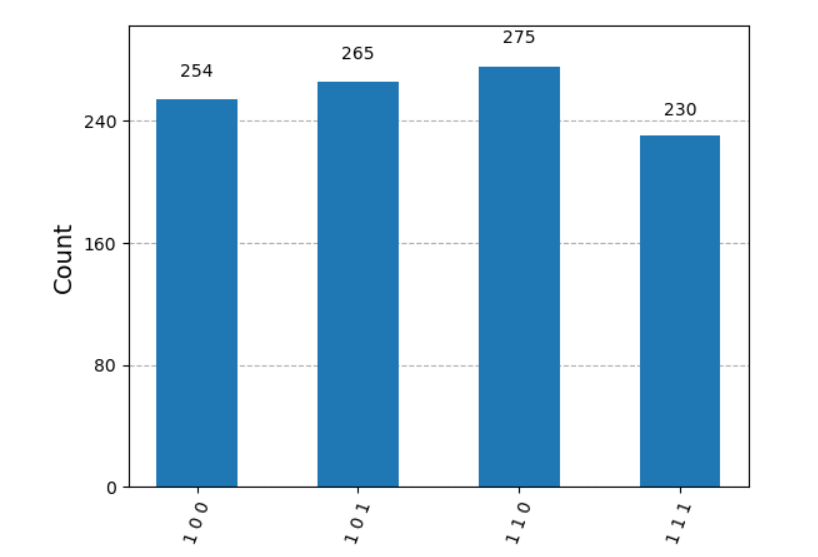

# Quantum Computing & Algorithms
This repository includes some of the qauntum computing operations and algorithms performed via Qiskit library on jupyter notebook
 

<h2>Currently we have implemented the following : </h2>
<ul>
  <li>Single Qubit Coding</li>
  <li>Multiple System and Tensor Product operation</li>
  <li>QuantumCircuit Class</li>
  <li>Quantum Teleportation via the phenomenon of Quantum Entanglement</li>
</ul>

<h2>Teleportation : Implementation</h2>

It is a protocol that is used to transfer a single qubit, via entangled qubits and two classical bits

Below , we have showed the result for transferring two states |0> and |1>, the first qubit represent the states received at the end
<ul>
  <li>Here is the result of circuit for transferring qubit in (1 0)T state  </li>
  <li>Here is the result of circuit for transferring qubit in (0 1)T state  </li>
</ul>
