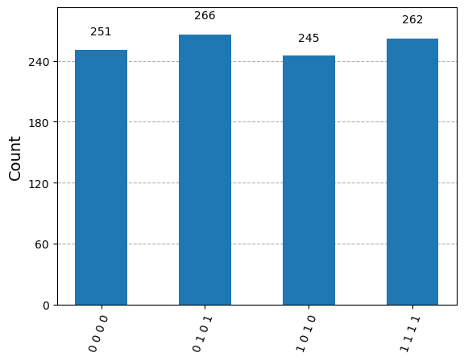

# Quantum Computing & Algorithms
This repository includes some of the qauntum computing operations and algorithms performed via Qiskit library on jupyter notebook
 

<h2>Currently we have implemented the following : </h2>
<ul>
  <li>Single Qubit Coding</li>
  <li>Multiple System and Tensor Product operation</li>
  <li>QuantumCircuit Class</li>
  <li>Quantum Teleportation via the phenomenon of Quantum Entanglement</li>
</ul>

<h2>Teleportation : Implementation</h2>

It is a protocol that is used to transfer a single qubit, via entangled qubits and two classical bits

Below , we have showed the result for transferring two states |0⟩ and |1⟩, the first qubit represent the states received at the end
<ul>
  <li>Here is the result of circuit for transferring qubit in (1 0)T state  </li>
  <li>Here is the result of circuit for transferring qubit in (0 1)T state  </li>
</ul>
<h2>Super Dense Coding</h2>

While teleportation is used for transferr1ing qubits, super dense coding transfers two classical bits via the use of entangled bits

 

1. Below is a sample of output where the first two bits are the input value of classical bits and the last two bits are the output measured of the final state of the system.
2. The circuit is randomly tried for all the four possible two bit combination (so we received four outputs).
3. And we can observe that last two bits are always the same as the first two means the information is correctly transferred.

